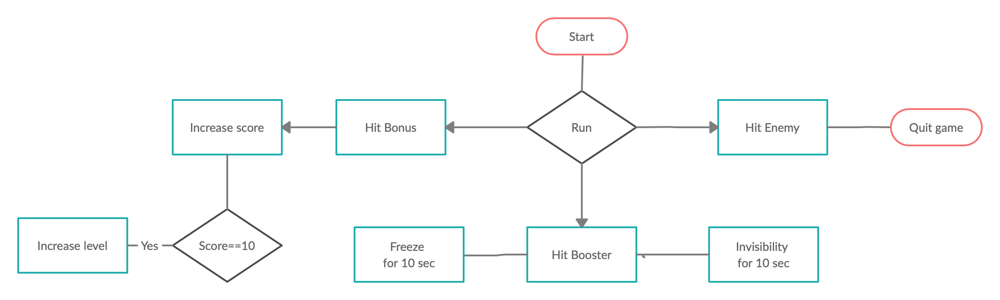

# Platformer Game Design Document
---
# Concept:

***Platforms:***  Windows, macOS, Linux

***Technologies:*** Unreal Engine, Blueprints

***Languages:***  English

***Audience:*** Gamers from 10 to 35 years old

***Genre:*** Platformer

***Mood:*** Positive, excitement, desire to win 

***Emotions:***  pleasure, delight, tenderness, curiosity

***Rating:***  CERO: A — All ages; ESRB: E10+ — Everyone 10+; PEGI: 7; RARS: 6+; USK: 6

***User Number:***  single-player

***Gameplay time:***  Unlimited 

***Main mechanic:***  Run, collecting bonuses and dodging enemies

***Setting:***   Low poly game 

***Goal:*** To reach maximum level
 
***Targeted audience***  
Gamers from 10 to 35 years old.
Those who want to distract themselves and kill time

# Game Character 

***Gameplay map:*** 
​

***Game mechanics and operating:*** 

- Actor moving: WASD

- Character rotation: move the mouse along the Y and X axes

- Interaction with objects: Avoiding enemies and obstacles, collecting bonuses and boosters

***Boosters:***

- Freeze - Slows down character and enemies

- Invisibility - gives character ability to move through obstacles adn enemies

***Bonus:***

- Crystall - increases score

***Enemy:***

- Bomb - kills character

  
# Interface 

***Visual:***
Three-dimensional space, path to infinity

***Level Design:***
Number of levels: infinty
- Level - The character runs endlessly along the road

***Balance:***

Name | Value |
---|---|
Player Speed | 300 | 
Player Speed Increase | 50 | 
Enemy Speed | 10 |
Enemy Speed Increase | 10 | 
Freeze booster time | 10 sec |
Invisibility booster time | 10 sec |

